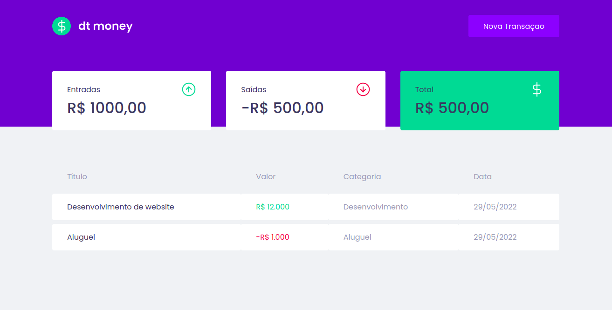

<div align="center">
  
</div>

<p align="center">
  <a href="#-projeto">Projeto</a>&nbsp;&nbsp;&nbsp;|&nbsp;&nbsp;&nbsp;
  <a href="#-técnologias">Tecnologias</a>&nbsp;&nbsp;&nbsp;|&nbsp;&nbsp;&nbsp;
  <a href="#-layout">Layout</a>&nbsp;&nbsp;&nbsp;|&nbsp;&nbsp;&nbsp;
  <a href="#-funcionalidades">Funcionalidades</a>&nbsp;&nbsp;&nbsp;|&nbsp;&nbsp;&nbsp;
  <a href="#-pré-requisitos">Pré-requisitos</a>&nbsp;&nbsp;&nbsp;|&nbsp;&nbsp;&nbsp;
  <a href="#-iniciando-o-projeto">Iniciando Projeto</a>&nbsp;&nbsp;&nbsp;
</p>

  
  


# ✨ *DTmoney*

## 💻 Projeto:

.

## 🔗 Disponivel em:

acesse: Contruindo

## 🚀 Técnologias

- [Reactjs](https://pt-br.reactjs.org/)
- [Typescript](https://www.typescriptlang.org/)


## 🔨 Funcionalidades

- [X] `Topicos`: Costruindo

## 📋 Pré-requisitos

- [Nodejs > 14.15v](https://nodejs.org/en/)

#

## 🔧 Iniciando o projeto

1 - Clone o projeto
```console
$ git clone git@github.com:AnaPerola/dtmoney.git
```
2 - Execute o comando para instalar todas as dependências
```console
$ yarn install
```
3 - Suba o projeto 
```console
$ yarn start
```

Se tudo ocorreu bem, visite: http://localhost:3000 😆

#

<div align="center" style="display:flex; padding:5px; ">
  
  
  
</div>          

---
⌨️ com ❤️ https://github.com/anaperola 😊
_juntamente com a Rocketseat no evento *Ignite*_

---
##### ⭐ Marque esse projeto com uma estrela
